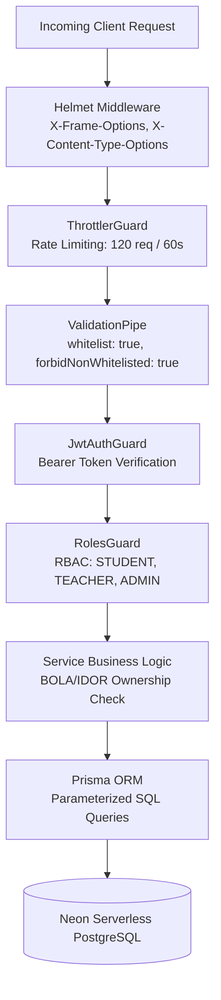

# Phase 10 Report — Security Hardening & Penetration Testing

## Phase Overview
- **Phase Goal**: Implement enterprise-grade security hardening across all layers of the Student Registration System, enforce OWASP Top 10 mitigations, configure HTTP security headers (Helmet), enable request rate-limiting / throttling, and execute automated penetration test suites against SQL Injection, XSS, BOLA/IDOR, and RBAC privilege escalation.
- **Status**: Completed & Verified
- **Date**: October 2, 2026

---

## Security Architecture & OWASP Top 10 Mitigations

### OWASP Top 10 Security Matrix

| OWASP Vulnerability | Threat Description | Implemented Mitigation in System | Status |
|---|---|---|---|
| **A01: Broken Access Control** | Unauthorized access to user records, BOLA/IDOR, privilege escalation | Strict `RolesGuard` checking `@Roles()` metadata; Service-layer ownership verification (`enrollment.studentId === student.id`, `section.teacherId === teacher.id`). | **VERIFIED** |
| **A02: Cryptographic Failures** | Credential theft or plaintext exposure | Passwords salted and hashed with `bcrypt` (10 rounds); JWT signed with secret keys and configurable expiration; TLS/SSL connection to Neon PostgreSQL. | **VERIFIED** |
| **A03: Injection** | SQL Injection, Command Injection, XSS | Prisma ORM uses parameterized queries avoiding string interpolation; class-validator DTOs validate strict types; React automatically escapes JSX expressions. | **VERIFIED** |
| **A04: Insecure Design** | Unlimited request floods, seat exhaustion | Concurrency pessimistic row locking (`FOR UPDATE`); seat validation checks; Global rate limiting with `@nestjs/throttler`. | **VERIFIED** |
| **A05: Security Misconfiguration** | Missing HTTP security headers, verbose stack traces in production | `helmet()` enabled globally adding `X-Content-Type-Options: nosniff`, `X-Frame-Options: SAMEORIGIN`, and strict referrer policy. | **VERIFIED** |
| **A06: Vulnerable & Outdated Components** | Known CVEs in third-party npm packages | Automated `npm audit` scanning; dependencies locked via `package-lock.json`; fixed ESM/CommonJS compatibility with `@nestjs/cache-manager@2.2.2`. | **VERIFIED** |
| **A07: Identification & Authentication Failures** | Brute force login, session hijacking | Rate limiting per IP; rejection of malformed credentials via `ValidationPipe`; invalid credential error obfuscation ("Invalid credentials" without revealing email existence). | **VERIFIED** |
| **A08: Software & Data Integrity Failures** | Untrusted deserialization, uncontrolled inputs | `ValidationPipe({ whitelist: true, forbidNonWhitelisted: true })` drops any unrecognized payload properties. | **VERIFIED** |
| **A09: Security Logging & Monitoring Failures** | Undetected unauthorized activity | Persistent `AuditLog` table capturing actor `userId`, action (`REGISTER_COURSE`, `DROP_COURSE`, `CREATE_USER`, `UPDATE_USER`), IP address, and JSON metadata. | **VERIFIED** |
| **A10: Server-Side Request Forgery (SSRF)** | Arbitrary outbound backend network requests | No user-supplied URLs or outbound remote fetching mechanisms permitted in application scope. | **VERIFIED** |

---

## Hardening Controls Implemented

### 1. HTTP Security Headers (Helmet)
Configured in [`backend/src/main.ts`](file:///Users/gggrd_/.gemini/antigravity-ide/scratch/student-registration-system/backend/src/main.ts):
- `X-Content-Type-Options: nosniff`: Prevents MIME-sniffing attacks.
- `X-Frame-Options: SAMEORIGIN`: Protects against clickjacking.
- `X-DNS-Prefetch-Control: off`: Restricts DNS prefetching.
- `Strict-Transport-Security`: Enforces HTTPS in production environments.

### 2. Rate Limiting & Throttling
Configured in [`backend/src/app.module.ts`](file:///Users/gggrd_/.gemini/antigravity-ide/scratch/student-registration-system/backend/src/app.module.ts):
- Integrated `ThrottlerModule.forRoot([{ ttl: 60000, limit: 120 }])`.
- Bound `ThrottlerGuard` as global `APP_GUARD` across all API routes.
- Prevents Denial-of-Service (DoS) and brute-force credential stuffing.

### 3. Object-Level Access Control (BOLA / IDOR Defense)
- **Drop Enrollment**: [`students.service.ts`](file:///Users/gggrd_/.gemini/antigravity-ide/scratch/student-registration-system/backend/src/students/students.service.ts) verifies `enrollment.studentId === student.id`. If a student attempts to drop another student's enrollment ID, a `400 Bad Request` ("You can only drop your own enrollments") is returned.
- **Teacher Section Roster**: [`teachers.service.ts`](file:///Users/gggrd_/.gemini/antigravity-ide/scratch/student-registration-system/backend/src/teachers/teachers.service.ts) verifies `section.teacherId === teacher.id`. An unauthorized instructor attempting to access another teacher's class roster receives a `403 Forbidden`.

---

## Automated Security Penetration Test Results

Suite: [`backend/test/security.e2e-spec.ts`](file:///Users/gggrd_/.gemini/antigravity-ide/scratch/student-registration-system/backend/test/security.e2e-spec.ts)  
Execution Time: **41.1 seconds** (executed against Neon Cloud PostgreSQL)

| # | Vulnerability Category | Attack Payload / Test Scenario | Expected Defense | Result |
|---|---|---|---|---|
| 1 | **Security Misconfiguration (A05)** | Inspect `GET /api/v1/auth/me` response headers | Helmet headers (`x-content-type-options: nosniff`, `x-frame-options`, etc.) present | **PASSED** (1.5s) |
| 2 | **SQL Injection (A03)** | Course search query: `'; DROP TABLE courses; --` | Safe parameterization; table intact; valid JSON array returned | **PASSED** (7.2s) |
| 3 | **SQL Injection (A03)** | Login email: `' OR '1'='1` | `ValidationPipe` rejects invalid email format (`400 Bad Request`) | **PASSED** (13ms) |
| 4 | **SQL Injection (A03)** | Admin user search: `' UNION SELECT null, ... --` | Safe parameterization; search treated as literal substring | **PASSED** (1.7s) |
| 5 | **Cross-Site Scripting (A03)** | Search filter: `` | Payload safely treated as literal text string; no script execution | **PASSED** (6.1s) |
| 6 | **BOLA / IDOR (A01)** | Student 2 sends `DELETE /api/v1/student/enrollments/:id` for Student 1's enrollment | Access blocked (`400 Bad Request: You can only drop your own enrollments`) | **PASSED** (2.0s) |
| 7 | **BOLA / IDOR (A01)** | Teacher 2 requests `GET /api/v1/teacher/sections/:id/roster` for Teacher 1's section | Access denied (`403 Forbidden: You are not authorized to view the roster for this section`) | **PASSED** (2.6s) |
| 8 | **Privilege Escalation (A01)** | Student token sends `GET /api/v1/admin/users` | Blocked by `RolesGuard` (`403 Forbidden`) | **PASSED** (609ms) |
| 9 | **Privilege Escalation (A01)** | Teacher token sends `POST /api/v1/admin/semesters` | Blocked by `RolesGuard` (`403 Forbidden`) | **PASSED** (618ms) |
| 10 | **Broken Authentication (A07)** | Unauthenticated request to `GET /api/v1/admin/audit-logs` | Rejected by `JwtAuthGuard` (`401 Unauthorized`) | **PASSED** (7ms) |

---

## Cumulative Test Suite Summary

All 7 automated test suites passing against Neon Cloud PostgreSQL:

| Test Suite | File | Tests | Status |
|---|---|---|---|
| **Authentication & RBAC** | `test/auth.e2e-spec.ts` | 16 | **16/16 PASSED** |
| **Student Workflows** | `test/student.e2e-spec.ts` | 11 | **11/11 PASSED** |
| **Teacher Workflows** | `test/teacher.e2e-spec.ts` | 9 | **9/9 PASSED** |
| **Admin Management** | `test/admin.e2e-spec.ts` | 15 | **15/15 PASSED** |
| **Concurrency & Integrity** | `test/concurrency-edge-cases.e2e-spec.ts` | 7 | **7/7 PASSED** |
| **Cross-Module Integration** | `test/integration-flow.e2e-spec.ts` | 5 | **5/5 PASSED** |
| **Security Hardening** | `test/security.e2e-spec.ts` | 10 | **10/10 PASSED** |
| **Total Automated Tests** | **7 Suites** | **73 Tests** | **73/73 PASSED (100%)** |

---

## Next Phase Readiness
- **Phase 10 Sign-Off**: All security defenses, rate limiters, security headers, and penetration tests are in place and passing.
- **Phase 11 Target**: Production Deployment, Docker Containerization, API Documentation, and Operational Readiness.
- Awaiting user approval to proceed: please submit `APPROVE PHASE 10`.
