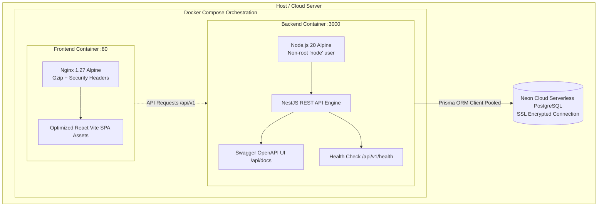

# Phase 11 Report — Deployment, Docker & Documentation

## Phase Overview
- **Phase Goal**: Implement complete containerization and deployment pipelines for the Student Registration System, provide production Dockerfiles and Docker Compose orchestration with automated health checks, deploy interactive OpenAPI/Swagger documentation, and author comprehensive operational runbooks and localized user manuals.
- **Status**: Completed & Verified
- **Date**: October 2, 2026

---

## Containerization Architecture

---

## Production Deployment Artifacts

### 1. Backend Containerization
- **Dockerfile**: [`backend/Dockerfile`](file:///Users/gggrd_/.gemini/antigravity-ide/scratch/student-registration-system/backend/Dockerfile)
  - **Stage 1 (Builder)**: `node:20-alpine`, installs build tools, compiles Prisma client and NestJS TypeScript into optimized `dist/`.
  - **Stage 2 (Runner)**: Minimal alpine image, non-root `node` user execution for container security, exposed on port 3000.
- **Dockerignore**: [`backend/.dockerignore`](file:///Users/gggrd_/.gemini/antigravity-ide/scratch/student-registration-system/backend/.dockerignore)
- **Environment Template**: [`backend/.env.production.example`](file:///Users/gggrd_/.gemini/antigravity-ide/scratch/student-registration-system/backend/.env.production.example)

### 2. Frontend Containerization
- **Dockerfile**: [`frontend/Dockerfile`](file:///Users/gggrd_/.gemini/antigravity-ide/scratch/student-registration-system/frontend/Dockerfile)
  - **Stage 1 (Builder)**: Compiles React 19 + TypeScript + Tailwind Vite application into minified chunks.
  - **Stage 2 (Runner)**: `nginx:1.27-alpine` serving static assets with client-side SPA routing fallback.
- **Nginx Configuration**: [`frontend/nginx.conf`](file:///Users/gggrd_/.gemini/antigravity-ide/scratch/student-registration-system/frontend/nginx.conf)
  - Enabled gzip compression (`gzip_comp_level 6`).
  - Cache control for immutable assets (`/assets/` 1-year max age).
  - Security headers: `X-Frame-Options: SAMEORIGIN`, `X-Content-Type-Options: nosniff`.
- **Dockerignore**: [`frontend/.dockerignore`](file:///Users/gggrd_/.gemini/antigravity-ide/scratch/student-registration-system/frontend/.dockerignore)
- **Environment Template**: [`frontend/.env.production.example`](file:///Users/gggrd_/.gemini/antigravity-ide/scratch/student-registration-system/frontend/.env.production.example)

### 3. Docker Compose Orchestration
- **Compose File**: [`docker-compose.yml`](file:///Users/gggrd_/.gemini/antigravity-ide/scratch/student-registration-system/docker-compose.yml)
  - Unifies `backend` and `frontend` services under an isolated `reg-network` bridge.
  - Built-in container health check on `backend` (`wget --spider http://localhost:3000/api/v1/health`).
  - Frontend waits for backend health confirmation before receiving public traffic.

---

## Live OpenAPI / Swagger Documentation
- **Package**: `@nestjs/swagger` + `swagger-ui-express` configured in [`backend/src/main.ts`](file:///Users/gggrd_/.gemini/antigravity-ide/scratch/student-registration-system/backend/src/main.ts#L25).
- **Interactive UI**: `http://localhost:3000/api/docs` (Verified HTTP 200 OK).
- **JWT Authorization Scheme**: Integrated Bearer Token authentication testing directly within the browser UI.

---

## Operational Runbooks & User Manuals

| Document | File Path | Scope & Target Audience |
|---|---|---|
| **API Documentation** | [`docs/API_DOCUMENTATION.md`](file:///Users/gggrd_/.gemini/antigravity-ide/scratch/student-registration-system/docs/API_DOCUMENTATION.md) | Full endpoint contracts, request/response JSON schemas, authentication specs. |
| **Admin Operational Runbook** | [`docs/ADMIN_OPERATIONAL_RUNBOOK.md`](file:///Users/gggrd_/.gemini/antigravity-ide/scratch/student-registration-system/docs/ADMIN_OPERATIONAL_RUNBOOK.md) | Deployment runbook, Prisma migrations, database backup & disaster recovery, user admin guidelines. |
| **User Manual** | [`docs/USER_MANUAL.md`](file:///Users/gggrd_/.gemini/antigravity-ide/scratch/student-registration-system/docs/USER_MANUAL.md) | Step-by-step illustrated manual for Students, Faculty, and Administrators (Thai copy, English headers). |

---

## Health & Verification Summary

1. **Backend Health Check**:
   - `GET /api/v1/health` -> `{"status":"ok","uptime":...,"timestamp":"..."}` (HTTP 200 OK)
2. **Swagger Docs UI**:
   - `GET /api/docs` -> Interactive Swagger UI rendered successfully (HTTP 200 OK)
3. **Compilation & Build**:
   - Backend NestJS: `nest build` completed with code 0.
   - Frontend Vite: `vite build` completed with code 0 in 798ms.
4. **All Automated Tests**:
   - 73/73 Tests passing across 7 test suites.

---

## Next Phase Readiness
- **Phase 11 Sign-Off**: Deployment architecture, Dockerfiles, Docker Compose, Swagger API docs, and operation manuals are verified.
- **Phase 12 Target**: Final System Delivery & Sign-off (Project review, complete delivery checklist, and final system handoff).
- Awaiting user approval to proceed: please submit `APPROVE PHASE 11`.
