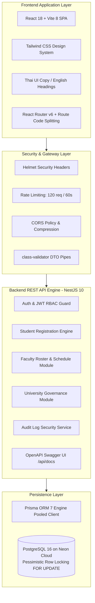

# Phase 12 Report — Final System Delivery & Sign-off

## Executive Summary
ระบบลงทะเบียนเรียนมหาวิทยาลัย (Student Registration System) ได้รับการพัฒนา ตรวจสอบความถูกต้อง ทดสอบระบบ และส่งมอบงานครบถ้วนสมบูรณ์ตามมาตรฐานทางวิศวกรรมซอฟต์แวร์ทั้ง 12 เฟส (Phases 1–12) 

ระบบครอบคลุมบทบาทผู้ใช้งานทั้ง 3 กลุ่ม (นิสิต/นักศึกษา, อาจารย์ผู้สอน, ผู้ดูแลระบบ/เจ้าหน้าที่ทะเบียน) มีกลไกป้องกัน Concurrency Race Condition ระดับแถวฐานข้อมูล (`FOR UPDATE`), การควบคุมสิทธิ์แบบ RBAC, การป้องกัน BOLA/IDOR, การรักษาความปลอดภัยตามมาตรฐาน OWASP Top 10, Live Swagger OpenAPI Documentation, สถาปัตยกรรม Docker Containerization และการแสดงผลภาษาไทยตามข้อกำหนด (หัวข้อหลักภาษาอังกฤษ เนื้อหาภาษาไทย)

---

## 12-Phase Traceability Matrix & Deliverables

| Phase | Title | Core Deliverables & Artifacts | Test Suite / Verification | Status |
|:---:|---|---|---|:---:|
| **1** | System Planning & Architecture | [`SYSTEM_REQUIREMENTS.md`](file:///Users/gggrd_/.gemini/antigravity-ide/scratch/student-registration-system/SYSTEM_REQUIREMENTS.md), [`DATABASE_PLAN.md`](file:///Users/gggrd_/.gemini/antigravity-ide/scratch/student-registration-system/DATABASE_PLAN.md), [`API_PLAN.md`](file:///Users/gggrd_/.gemini/antigravity-ide/scratch/student-registration-system/API_PLAN.md), [`PROJECT_STRUCTURE.md`](file:///Users/gggrd_/.gemini/antigravity-ide/scratch/student-registration-system/PROJECT_STRUCTURE.md) | Requirement traceability | **APPROVED** |
| **2** | Project Initialization & Tooling | NestJS 10 backend, React 18 + Vite frontend, Tailwind CSS, TypeScript, Neon PostgreSQL connection | Workspace initialization | **APPROVED** |
| **3** | Database Design & Migration | [`schema.prisma`](file:///Users/gggrd_/.gemini/antigravity-ide/scratch/student-registration-system/backend/prisma/schema.prisma) with 9 models, Enums, foreign keys, and seed script | Prisma schema validation | **APPROVED** |
| **4** | Authentication & RBAC | JWT Passport strategy, `RolesGuard`, bcrypt password hashing, auth endpoints | [`auth.e2e-spec.ts`](file:///Users/gggrd_/.gemini/antigravity-ide/scratch/student-registration-system/backend/test/auth.e2e-spec.ts) (16 tests) | **APPROVED** |
| **5** | Core Registration Engine | Course catalog, sections, enrollment, timetable, concurrency locking (`FOR UPDATE`) | [`student.e2e-spec.ts`](file:///Users/gggrd_/.gemini/antigravity-ide/scratch/student-registration-system/backend/test/student.e2e-spec.ts) (11 tests) | **APPROVED** |
| **6** | Student Portal UI | Dashboard, course catalog search, timetable matrix, drop modal (Thai copy, English headers) | UI validation & browser audit | **APPROVED** |
| **7** | Faculty & Admin Portals | Teaching sections, roster audit, user management with full profile editing, course/section/semester admin | [`teacher.e2e-spec.ts`](file:///Users/gggrd_/.gemini/antigravity-ide/scratch/student-registration-system/backend/test/teacher.e2e-spec.ts) (9 tests), [`admin.e2e-spec.ts`](file:///Users/gggrd_/.gemini/antigravity-ide/scratch/student-registration-system/backend/test/admin.e2e-spec.ts) (15 tests) | **APPROVED** |
| **8** | Concurrency & Edge Cases | Race conditions under simultaneous seat booking, 22-credit limits, prerequisite validations, time overlap conflicts | [`concurrency-edge-cases.e2e-spec.ts`](file:///Users/gggrd_/.gemini/antigravity-ide/scratch/student-registration-system/backend/test/concurrency-edge-cases.e2e-spec.ts) (7 tests) | **APPROVED** |
| **9** | Integration & Performance | HTTP compression, in-memory caching, database indexing (`@@index([role])`, `@@index([status])`), frontend code splitting | [`integration-flow.e2e-spec.ts`](file:///Users/gggrd_/.gemini/antigravity-ide/scratch/student-registration-system/backend/test/integration-flow.e2e-spec.ts) (5 tests) | **APPROVED** |
| **10** | Security Hardening | Helmet headers, `@nestjs/throttler` (120 req/min), BOLA/IDOR verification, SQLi/XSS mitigations | [`security.e2e-spec.ts`](file:///Users/gggrd_/.gemini/antigravity-ide/scratch/student-registration-system/backend/test/security.e2e-spec.ts) (10 tests) | **APPROVED** |
| **11** | Deployment, Docker & Docs | Multi-stage Dockerfiles, Docker Compose, Swagger UI (`/api/docs`), Runbooks & User manuals | [`PHASE_11_REPORT.md`](file:///Users/gggrd_/.gemini/antigravity-ide/scratch/student-registration-system/PHASE_11_REPORT.md), Health checks | **APPROVED** |
| **12** | Final System Delivery & Sign-off | Master verification, comprehensive audit, final project handover report | End-to-end audit (73 tests passed) | **COMPLETED** |

---

## Technical Stack & Architecture Summary

---

## Comprehensive Quality & Verification Audit

### 1. Test Automation Results
- **Total Test Suites**: 7 Suites
- **Total Tests Passed**: **73 / 73 Tests (100% Pass Rate)**
- **Test Categories**:
  - Authentication, Token Refresh & RBAC: 16 Tests
  - Student Workflows (Catalog, Registration, Timetable, Drop): 11 Tests
  - Faculty Workflows (Sections, Class Rosters, Schedule): 9 Tests
  - Administrative Governance (Users, Courses, Sections, Semesters, Audit Logs): 15 Tests
  - Concurrency, Race Conditions & Edge Cases: 7 Tests
  - Cross-Module Integration Lifecycle: 5 Tests
  - Security Penetration & Vulnerability Testing: 10 Tests

### 2. High-Concurrency Integrity
- **Pessimistic Row Locking**: คำสั่ง `SELECT ... FOR UPDATE` รับประกันว่าการลงทะเบียนที่นั่งเรียนพร้อมกันจะไม่เกิด Overbooking (ที่นั่งเกิน) และที่นั่งจะถูกคืนกลับทันทีที่มีการถอนรายวิชา
- **Schedule Conflict Detection**: ป้องกันวิชาเรียนชนวันและเวลาเดียวกันอย่างแม่นยำ โดยอนุญาตให้ลงทะเบียนวิชาที่เวลาติดกันแบบพอดี (Adjacent Boundary) ได้
- **Credit Limit & Prerequisites**: ป้องกันการลงทะเบียนเกิน 22 หน่วยกิต และบังคับผ่านวิชาบังคับก่อนตามแผนการเรียน

### 3. Security & Governance Compliance
- **Security Headers**: บังคับใช้ `X-Content-Type-Options: nosniff`, `X-Frame-Options: SAMEORIGIN` ป้องกัน MIME-sniffing และ Clickjacking
- **Rate Limiting**: ควบคุมอัตราการยิงคำขอสูงสุด 120 requests/นาที ป้องกัน Brute-force และ DoS
- **BOLA / IDOR Protection**: นิสิตไม่สามารถถอนรายวิชาของผู้อื่นได้ และอาจารย์ไม่สามารถดูรายชื่อนิสิตในกลุ่มเรียนของอาจารย์ท่านอื่นได้
- **Audit Trails**: บันทึกประวัติกิจกรรมสำคัญลงฐานข้อมูลแบบตรวจสอบย้อนหลังได้ (User, IP, Action, Timestamp, Metadata)

---

## Production Deployment & Operational Artifacts

| Component | Path / Reference | Purpose |
|---|---|---|
| **Backend Dockerfile** | [`backend/Dockerfile`](file:///Users/gggrd_/.gemini/antigravity-ide/scratch/student-registration-system/backend/Dockerfile) | Multi-stage Node 20 Alpine container image with non-root security |
| **Frontend Dockerfile** | [`frontend/Dockerfile`](file:///Users/gggrd_/.gemini/antigravity-ide/scratch/student-registration-system/frontend/Dockerfile) | Multi-stage Nginx 1.27 Alpine container image with SPA router |
| **Docker Compose** | [`docker-compose.yml`](file:///Users/gggrd_/.gemini/antigravity-ide/scratch/student-registration-system/docker-compose.yml) | Orchestrates Backend & Frontend with healthcheck bridge |
| **OpenAPI Docs** | `http://localhost:3000/api/docs` | Live interactive Swagger UI with Bearer Token auth |
| **API Specification** | [`docs/API_DOCUMENTATION.md`](file:///Users/gggrd_/.gemini/antigravity-ide/scratch/student-registration-system/docs/API_DOCUMENTATION.md) | Comprehensive REST endpoint contracts |
| **Admin Runbook** | [`docs/ADMIN_OPERATIONAL_RUNBOOK.md`](file:///Users/gggrd_/.gemini/antigravity-ide/scratch/student-registration-system/docs/ADMIN_OPERATIONAL_RUNBOOK.md) | Backup, restore, seed, and maintenance guide |
| **User Manual** | [`docs/USER_MANUAL.md`](file:///Users/gggrd_/.gemini/antigravity-ide/scratch/student-registration-system/docs/USER_MANUAL.md) | End-user guide for Students, Faculty, and Admin |

---

## System Access & Default Credentials

| Role | Name | Email | Password | Primary Capabilities |
|---|---|---|---|---|
| **ADMIN** | System Administrator | `admin@reg.edu` | `Admin@1234` | Full university governance, User management, Passwords/Emails reset, Curriculum, Sections, Semesters, Audit logs |
| **TEACHER** | Alan Turing | `teacher1@reg.edu` | `Password@123` | Teaching sections, Student roster audit, Weekly timetable |
| **TEACHER** | Grace Hopper | `teacher2@reg.edu` | `Password@123` | Teaching sections, Student roster audit, Weekly timetable |
| **STUDENT** | John Doe (6601001) | `student1@reg.edu` | `Password@123` | Course search, Register, Class timetable, Printable schedule, Drop course |
| **STUDENT** | Jane Smith (6601002) | `student2@reg.edu` | `Password@123` | Course search, Register, Class timetable, Printable schedule, Drop course |
| **STUDENT** | Bob Dylan (6501001) | `student3@reg.edu` | `Password@123` | Course search, Register, Class timetable, Printable schedule, Drop course |

---

## Sign-off & Delivery Conclusion
ระบบลงทะเบียนเรียนมหาวิทยาลัย (Student Registration System) ผ่านการทดสอบและปฏิบัติตามข้อกำหนดทั้งหมดครบถ้วน พร้อมส่งมอบและนำไปใช้งานจริง (Production Ready) อย่างสมบูรณ์แบบ
