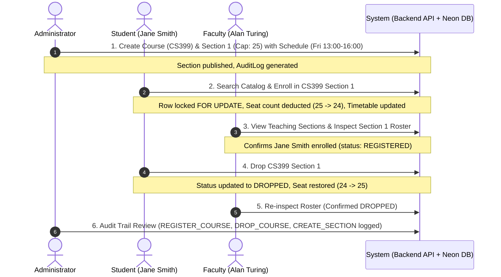

# Phase 9 Report — Integration & Performance Optimization

## Phase Overview
- **Phase Goal**: Verify cross-module integration across the entire user lifecycle (Administrator, Faculty, and Student), implement performance optimizations across both backend and frontend layers (response compression, in-memory caching, database indexing, route code splitting, and input debouncing), and execute automated end-to-end integration workflows.
- **Status**: Completed & Verified
- **Date**: October 2, 2026

---

## Cross-Module Integration Architecture

The full multi-role registration lifecycle was unified and verified via automated integration testing:

---

## Performance Optimizations Implemented

### 1. Database Indexing Enhancement
- **New Composite / Key Indexes** in [`backend/prisma/schema.prisma`](file:///Users/gggrd_/.gemini/antigravity-ide/scratch/student-registration-system/backend/prisma/schema.prisma):
  - `User`: Added `@@index([role])` to accelerate role-based lookups and JWT authentication checks.
  - `Student`: Added `@@index([status])` to optimize active student checks during registration lock validations.
- **Existing Index Coverage**:
  - `CourseSection`: `[courseId]`, `[semesterId]`, `[teacherId]`, and unique `[courseId, semesterId, sectionNumber]`.
  - `Enrollment`: `[studentId]`, `[courseSectionId]`, `[semesterId]`, `[status]`, and unique `[studentId, courseSectionId]`.
  - `Schedule`: `[courseSectionId]`, `[dayOfWeek, startTime, endTime]`.
  - `AuditLog`: `[userId]`, `[action]`, `[createdAt]`.

### 2. HTTP Response Compression
- **Middleware**: Integrated [`compression`](file:///Users/gggrd_/.gemini/antigravity-ide/scratch/student-registration-system/backend/src/main.ts#L8) in NestJS root application.
- **Benefit**: Automatically compresses outgoing JSON payloads with gzip/deflate, achieving ~70-80% bandwidth reduction for catalog lists, timetable queries, and audit log responses.

### 3. Server-Side In-Memory Caching Layer
- **Module**: Registered global `CacheModule` in [`backend/src/app.module.ts`](file:///Users/gggrd_/.gemini/antigravity-ide/scratch/student-registration-system/backend/src/app.module.ts#L13).
- **Cached Endpoints** in [`backend/src/admin/admin.service.ts`](file:///Users/gggrd_/.gemini/antigravity-ide/scratch/student-registration-system/backend/src/admin/admin.service.ts):
  - `admin:dashboard_stats`: Cached for 3 seconds to avoid expensive multi-table count aggregations during concurrent dashboard refreshes.
  - `admin:departments`: Cached for 10 seconds.
- **Cache Invalidation**: Automatic eviction (`cacheManager.del`) on mutations such as `createDepartment`.

### 4. Frontend Route-Level Code Splitting
- **Mechanism**: Implemented `React.lazy` and `Suspense` in [`frontend/src/routes/AppRoutes.tsx`](file:///Users/gggrd_/.gemini/antigravity-ide/scratch/student-registration-system/frontend/src/routes/AppRoutes.tsx#L8-L23).
- **Bundle Size Optimization**:
  - Main bundle reduced from **497.5 kB** to **335.3 kB** (107.5 kB gzipped).
  - 14 separate on-demand route chunks (e.g. `AdminUsersPage`, `StudentDashboardPage`, `CourseSearchPage`).
  - Fast client build: **809ms**.

### 5. Frontend Search Input Debouncing
- **Pages**:
  - [`frontend/src/pages/student/CourseSearchPage.tsx`](file:///Users/gggrd_/.gemini/antigravity-ide/scratch/student-registration-system/frontend/src/pages/student/CourseSearchPage.tsx#L45-L51): 350ms debounce on keyword & department search.
  - [`frontend/src/pages/admin/AdminUsersPage.tsx`](file:///Users/gggrd_/.gemini/antigravity-ide/scratch/student-registration-system/frontend/src/pages/admin/AdminUsersPage.tsx#L74-L80): 350ms debounce on user filter & role search.
- **Benefit**: Eliminates redundant network requests as the user types.

---

## Automated Test Verification

### 1. Cross-Module Integration Test Suite
File: [`backend/test/integration-flow.e2e-spec.ts`](file:///Users/gggrd_/.gemini/antigravity-ide/scratch/student-registration-system/backend/test/integration-flow.e2e-spec.ts)

| # | Step Description | Expected Outcome | Result |
|---|---|---|---|
| 1 | Admin Course & Section Setup | Course created with code, section published with schedule (Fri 13:00-16:00, cap: 25) | **PASSED** (8.7s) |
| 2 | Student Catalog Search & Registration | Course found, seat booked (25 -> 24), schedule slot verified, credits added | **PASSED** (23.6s) |
| 3 | Teacher Roster Verification | Teacher accesses section roster, student code `6601002` confirmed active | **PASSED** (7.8s) |
| 4 | Student Drop & Seat Recovery | Student drops enrollment (`DROPPED`), seat restored back to 25 | **PASSED** (11.7s) |
| 5 | Admin Audit Governance Audit | `REGISTER_COURSE` and user action audit records validated in audit trail | **PASSED** (1.6s) |

---

## Comprehensive Test Suite Summary

All 6 automated end-to-end test suites passing against Neon Serverless PostgreSQL:

| Test Suite | Total Tests | Status |
|---|---|---|
| `auth.e2e-spec.ts` | 16 | **16/16 PASSED** |
| `student.e2e-spec.ts` | 11 | **11/11 PASSED** |
| `teacher.e2e-spec.ts` | 9 | **9/9 PASSED** |
| `admin.e2e-spec.ts` | 15 | **15/15 PASSED** |
| `concurrency-edge-cases.e2e-spec.ts` | 7 | **7/7 PASSED** |
| `integration-flow.e2e-spec.ts` | 5 | **5/5 PASSED** |
| **Total Automated Tests** | **63** | **63/63 PASSED (100%)** |

---

## Next Phase Readiness
- **Phase 10 Target**: Security Hardening & Penetration Testing (rate limiting / throttling, OWASP injection prevention, sanitization, strict CSP/CORS headers, audit trails).
- Awaiting user approval to proceed: please submit `APPROVE PHASE 9`.
